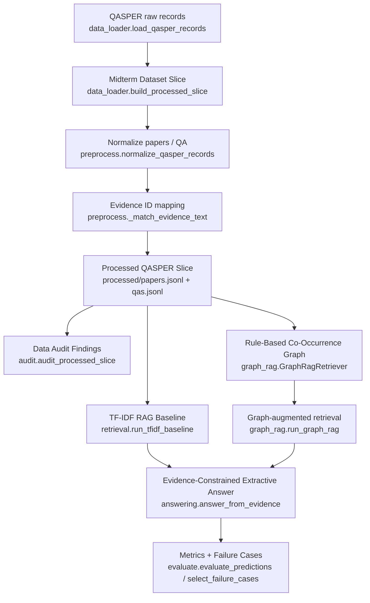
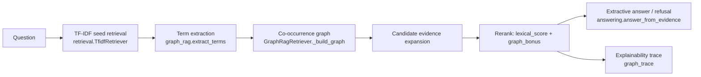

# 数据挖掘课程项目 - 中期进展报告

> 项目当前阶段：Minimum Runnable GraphRAG Baseline 已跑通，并已在真实 QASPER 小切片上生成中期评测结果。  

## 0. 项目基本信息

- **项目名称**：面向计算机科学论文的证据约束型 GraphRAG 问答系统
- **项目链接**：https://github.com/RouVen-crp/DataExcavate_Proj
- **小组成员与分工**：

| 姓名 | 学号 | 组内角色 | 开题以来的核心贡献 | 中期之后的分工规划 |
| :--- | :--- | :--- | :--- | :--- |
| 吴雨霏 | 3220251395 | 数据与审计负责人 | 参与 QASPER 数据下载、清洗规则确认、数据质量审计与脏数据类型整理 | 扩大数据切片审计，补充 evidence mismatch、long document、unanswerable 子集分析 |
| 王文正 | 3120250953 | 数据与审计负责人 | 参与数据预处理验收、审计指标核对与运行结果整理 | 配合数据质量分析和报告图表整理，复核真实数据运行日志 |
| 唐易成 | 3220251363 | 图谱构建负责人 | 完成中期轻量 Rule-Based Co-Occurrence Graph，保留来源段落 ID 与 graph trace | 继续推进实体/关系抽取、实体规范化、边权设计，评估是否引入 Neo4j |
| 李昊 | 3220251322 | 检索与生成负责人 | 完成 TF-IDF RAG Baseline、GraphRAG 检索器、抽取式回答与拒答策略 | 引入 BM25 或 Dense Vector RAG 对照，优化拒答阈值与答案生成质量 |
| 牛煜雯 | 3220251288 | 评测负责人 | 完成 Evidence Recall@K、Answer Token F1、Refusal Accuracy、Latency 与 Failure Cases 输出 | 负责消融实验、指标表格、失败案例分析和最终报告实验部分 |

## 1. 项目概述与当前状态

### 1.1. 中期里程碑达成情况

- **开题计划目标**：项目开题时计划构建“知识图谱检索 + 路径证据推理”的问答系统，在长文本论文问答场景下降低幻觉；数据集选择 QASPER；基线包括 BM25-RAG 与 Dense Vector RAG；核心方案包括实体/关系抽取、实体规范化、子图检索、路径证据拼接和拒答机制；评估 Answer F1/EM、Evidence Precision/Recall/F1、Faithfulness、Unsupported Claim Rate、拒答准确率和平均延迟。
- **中期实际达成**：已完成一个 CPU-only、可一键复现的 Minimum Runnable GraphRAG Baseline。当前代码能通过 `run_midterm.py` 加载真实 QASPER 小切片，输出 Processed QASPER Slice、数据审计、TF-IDF RAG Baseline、Rule-Based Co-Occurrence GraphRAG、抽取式回答、拒答结果、评测指标和 Failure Cases。已在真实 QASPER train split 小切片上完成运行：12 篇论文、60 个 QA、1053 个段落。

### 1.2. 代码仓库状态审计

- **提交统计**：
  - 总 commit 数：22 次。
  - 开题后新增 commit 数：22次
  - 活跃贡献人数：5/5人均有提交。
- **分支与协作方式**：
  - 当前主分支：`main`。
  - 远程仓库：`origin https://github.com/RouVen-crp/DataExcavate_Proj.git`。
  - Git 历史中可见 PR 合并记录，例如 `Merge pull request #9 from yezhuqiu111/main` 和 `Merge pull request #10 from HUAIJURENSHEN/main`。
- **当前仓库目录结构**：

```text
DataExcavate_Proj/
├── README.md                    # 环境配置、一键运行命令、输出文件说明
├── CONTEXT.md                   # 项目领域词汇表
├── AGENTS.md                    # agent 工作约定
├── requirements.txt             # Python 依赖：datasets、pytest
├── run_midterm.py               # 一键运行入口，串联数据、检索、回答、评测与导出
├── src/
│   ├── data_loader.py           # 本地 JSON/JSONL 与 HuggingFace QASPER 加载
│   ├── preprocess.py            # QASPER 标准化、evidence 映射、Processed QASPER Slice 写出
│   ├── audit.py                 # 数据审计：长度、evidence 映射、unanswerable 统计
│   ├── retrieval.py             # TF-IDF RAG Baseline
│   ├── graph_rag.py             # Rule-Based Co-Occurrence GraphRAG、trace 输出
│   ├── answering.py             # Evidence-Constrained Extractive Answer 与拒答
│   └── evaluate.py              # Evidence Recall@K、Answer Token F1、Refusal Accuracy、失败案例
├── tests/                       # pytest 行为测试与 smoke suite
├── docs/                        # 报告模板、交接文档、ADR 与 agent 文档
├── .scratch/                    # 本地 markdown issue tracker 与 PRD
└── results/                     # 本地生成结果，已被 .gitignore 排除
```

## 2. 数据工程与审计落地

### 2.1. 原始数据审计反馈

开题报告确定数据集为 QASPER，其总体规模约 1585 篇论文、5049 个问题，官方划分为 Train 888 篇、Validation 281 篇、Test 416 篇。本次中期审计先使用 QASPER train split 的 Midterm Dataset Slice：12 篇论文、60 个 QA、1053 个段落。运行输出见 `results/qasper_midterm/audit.json`。

| 数据问题 | 量化规模 | 解决方案（精确到文件/函数） | 处理后效果 |
| :--- | :--- | :--- | :--- |
| 文档长度差异明显，长文档会稀释直接检索效果 | 12 篇论文中有 5 篇超过 4000 words；最长 7255 words，平均 3866 words | `src/audit.py::audit_processed_slice` 统计长文档；`src/retrieval.py::TfidfRetriever.retrieve` 按同一 paper 内段落级 top-k 检索 | 将 QA 输入从整篇论文缩小到 top-k evidence paragraphs，为 RAG 与 GraphRAG 提供可控检索空间 |
| 存在长段落，单段证据仍可能过长 | 1053 个段落中有 11 个超过 250 words；最长段落 499 words | `src/audit.py::audit_processed_slice` 标记长段落；`src/answering.py::_best_sentence` 在 top evidence 中选最相关句子 | 即使检索段落较长，回答模块也只抽取 Top Evidence Sentence Answer，减少无关上下文 |
| 部分 gold evidence 无法映射到段落 ID | 60 个 QA 中有 7 个出现 evidence 缺失或不完整；共 10 条 evidence match missing；83 条 exact match，0 条 partial match | `src/preprocess.py::_match_evidence_text` 增加归一化匹配和段落子串 partial match；`src/audit.py` 输出 exact/partial/missing 计数 | 当前切片大多数 evidence 可 exact match；缺失样本被显式记录，避免评测时误以为是检索模型失败 |
| QASPER 包含不可回答问题，需要拒答能力 | 60 个 QA 中有 11 个 unanswerable，占 18.33% | `src/answering.py::answer_from_evidence` 实现 Retrieval-Based Refusal；`src/evaluate.py::evaluate_predictions` 统计 Refusal Accuracy | 当前 GraphRAG Refusal Accuracy 为 27.27%，baseline 为 18.18%，说明拒答路径已可度量但仍需调参 |
| 开题预测的“大量 partial evidence mismatch”未明显发生 | 本次切片 partial_match_count = 0 | 保留 `src/preprocess.py::_match_evidence_text` 的 partial match 逻辑作为兼容保障 | 真实小切片中 evidence 多数能 exact match；后续扩大数据规模时继续观察 |
| 开题预测的“术语别名与实体歧义”尚未完全解决 | 当前中期版仅做 token 级 term 抽取，未统计实体别名规模 | `src/graph_rag.py::extract_terms` 做基础 term 过滤；实体规范化和别名合并尚未实现 | 中期版可证明图增强检索闭环，但完整实体规范化需在终期补齐 |

### 2.2. 数据流与预处理管道



## 3. 基线模型与核心算法实现

### 3.1. 基线模型运行情况说明

- **开题计划基线**：BM25-RAG（关键词检索 + LLM 生成）和 Dense Vector RAG（段落向量检索 / FAISS + LLM 生成）。
- **中期已实现基线**：TF-IDF RAG Baseline。系统在每篇论文内部按段落构建 TF-IDF 表示，根据 question 检索 top-k 段落，再从 top evidence 中抽取最相关句子作为 Evidence-Constrained Extractive Answer。该实现不依赖外部 API 和 GPU，主要用于先完成可复现闭环；BM25 与 Dense Vector RAG 将作为终期增强对照。
- **运行环境**：Windows + Python 3.11 Conda 环境，CPU-only；不依赖 GPU、Neo4j、向量数据库或 LLM API key。
- **一键复现命令**：

```bash
python run_midterm.py --max-papers 20 --max-qas 60 --top-k 5 --output-dir results/qasper_midterm
```

- **关键输出日志片段**：

```text
papers=12 qas=60 output_dir=results\qasper_midterm
baseline_recall@5=0.420 baseline_f1=0.067
graphrag_recall@5=0.440 graphrag_f1=0.079
failure_cases=2
```

- **测试验证**：

```text
D:\miniconda3\envs\dm\python.exe -m pytest
12 passed

D:\miniconda3\envs\dm\python.exe tests\run_smoke_tests.py
smoke tests passed
```

### 3.2. 核心进阶算法开发进度

开题报告中的完整核心方案是“证据约束 GraphRAG”：从论文段落抽取 Method、Dataset、Metric、Conclusion 等实体和关系，进行实体规范化，再基于问题图化执行 k-hop 子图检索，并按路径证据拼接上下文。中期阶段已实现其最小可运行版本：Rule-Based Co-Occurrence GraphRAG。它以 TF-IDF top seed evidence 为起点，从 question 和 seed paragraph 中抽取 terms，通过同段共现图做一跳扩展，收集 candidate evidence，再用 lexical score + graph bonus 重排。每条 GraphRAG 预测会保存 `graph_trace`，记录 seed evidence、query terms、expanded terms、expansion paths、candidate evidence 和 returned evidence。



| 模块 | 对应文件 | 状态 | 备注 |
| :--- | :--- | :---: | :--- |
| 数据预处理管道 | `src/preprocess.py`、`src/data_loader.py` | 完成 | 支持本地 JSON/JSONL 与 HuggingFace QASPER；新增 evidence exact/partial/missing match |
| 基线模型 | `src/retrieval.py` | 完成 | 纯标准库 TF-IDF，CPU-only |
| 核心进阶算法 | `src/graph_rag.py` | 完成中期版 | 已实现规则共现图、一跳扩展、graph bonus rerank、trace 输出；Neo4j、实体规范化、k-hop 路径评分待终期推进 |
| 回答与拒答 | `src/answering.py` | 完成中期版 | 支持抽取式回答与 Retrieval-Based Refusal |
| 评测框架 | `src/evaluate.py` | 完成 | Evidence Recall@K、Answer Token F1、Refusal Accuracy、Latency、Failure Cases |
| 单元测试 / 集成测试 | `tests/` | 完成 | 12 个 pytest 用例 + 无 pytest smoke suite |

## 4. 中期实验结果与阶段性分析

### 4.1. 评估指标与测试集构建

- **评测数据集规模**：真实 QASPER train split 中截取的 Midterm Dataset Slice：12 篇论文、60 个 QA、1053 个段落。
- **开题计划指标**：Exact Match、Token F1、Evidence Precision/Recall/F1、Faithfulness（RAGAS）、Unsupported Claim Rate、不可回答问题拒答准确率、平均响应时延。
- **中期已落地指标**：
  - Evidence Recall@5：gold evidence paragraph 是否出现在 top-5 retrieved evidence 中。
  - Answer Token F1：预测答案与 reference answers 的 token overlap F1。
  - Refusal Accuracy：unanswerable QA 中系统是否正确输出 `INSUFFICIENT_EVIDENCE`。
  - Average Latency：每个 query 的平均检索和回答耗时，单位为 ms。
  - 暂未落地：Exact Match、Evidence Precision/F1、RAGAS Faithfulness、Unsupported Claim Rate 和 NLI 一致性检测。这些指标需要 LLM/NLI 或更细粒度 claim 级评测，计划放到终期扩展。

### 4.2. 定量对比实验结果

| 模型方法 (Method) | Evidence Recall@5 | Answer Token F1 | Refusal Accuracy | 平均耗时 (Latency) |
| :--- | :---: | :---: | :---: | :---: |
| TF-IDF RAG Baseline（中期替代 BM25/Dense Vector RAG） | 42.00% | 0.067 | 18.18% | **0.24 ms/query** |
| **Rule-Based Co-Occurrence GraphRAG** | **44.00% (+2.00%)** | **0.079 (+0.012)** | **27.27% (+9.09%)** | 12.45 ms/query |

结果说明：GraphRAG 中期版相对 TF-IDF baseline 在 Evidence Recall@5、Answer Token F1 和 Refusal Accuracy 上均有小幅提升，但耗时明显更高。当前 graph expansion 仍是规则共现和一跳扩展，效果提升有限，主要价值在于证明项目核心方向已跑通且可解释。

### 4.3. 实验结果初步诊断与分析

| # | 输入（Query 片段） | 模型输出 | 正确答案 | 失败原因 | 改进方向 |
| :- | :--- | :--- | :--- | :--- | :--- |
| 1 | What are the results? | `INSUFFICIENT_EVIDENCE` | 报告不同模型在 all data 和 subset training 下的 accuracy，例如 ACP-BERT 0.933、ACP+AL+CA+CO-BiGRU 0.917 等 | retrieval_miss：gold evidence 位于 `1909.00694::p0036`、`p0038`，但 top-5 返回 `p0026`、`p0042`、`p0019` 等 | 改进段落排名与 graph expansion，增加数值/结果表格相关 term 的权重 |
| 2 | What are labels available in dataset for supervision? | `INSUFFICIENT_EVIDENCE` | `negative`、`positive` | retrieval_miss：gold evidence 为 `1909.00694::p0000`，但 GraphRAG top-5 返回 `p0048`、`p0027`、`p0042` 等 | 加强 dataset/label 相关 keyphrase 抽取，避免共现图被泛化实验段落吸走 |

- **总体优缺点小结**：当前 Minimum Runnable GraphRAG Baseline 已能在真实 QASPER 小切片上复现完整结果，并保存可解释 trace 与失败案例。GraphRAG 相比 TF-IDF 有小幅提升，但由于图构建仍依赖规则 token 共现，存在候选扩展过宽、语义匹配弱和 latency 上升的问题。终期阶段应优先改进 keyphrase extraction、BM25/sklearn TF-IDF baseline、graph edge weight 和拒答阈值调参。

## 5. 后续风险评估与冲刺排期

### 5.1. 风险清单动态调整

- **开题风险 1：图谱抽取质量不足，导致检索路径错误**  
  状态：部分发生。中期版尚未做完整实体/关系抽取和 Neo4j 入库，先用规则共现图降低实现风险；当前 GraphRAG Recall@5 只比 TF-IDF baseline 高 2 个百分点。  
  预案：延续开题预案，先定义小而稳的关系模式（Task-Method-Dataset-Metric），小样本人审抽取质量，保留 lexical retrieval 回退通道；终期逐步增加实体规范化和 edge weight。
- **开题风险 2：模型调用成本或算力受限**  
  状态：已规避。中期版本不依赖 LLM API、GPU、Neo4j 或 FAISS，全部 CPU-only 运行；代价是生成能力和语义检索能力暂未充分展开。  
  预案：终期若加入 LLM 生成或 Dense Vector RAG，保持 optional 路径；高成本环节使用缓存和小切片评测，默认 baseline 仍保持可运行。
- **新增风险 1：GraphRAG latency 明显高于 baseline**  
  状态：已发生。GraphRAG 平均 12.45 ms/query，TF-IDF baseline 平均 0.24 ms/query。  
  预案：缓存每篇论文的 lexical scores、限制 expansion terms、按 paper 预构建索引、减少全量 rerank。
- **新增风险 2：QASPER evidence 映射不完整影响评测可信度**  
  状态：部分发生。60 个 QA 中有 7 个出现 evidence 缺失或不完整。  
  预案：继续完善 `preprocess._match_evidence_text`，引入更稳的文本归一化和 fuzzy match；报告中单独标注 missing evidence 样本。

### 5.2. 终期冲刺详细排期（第 13 周 - 第 16 周）

| 周次 | 核心任务目标 | 责任人 | 预期交付物 / 验收标准 |
| :--- | :--- | :--- | :--- |
| **第 13 周** | 固化中期 baseline，补齐报告信息，确认真实 QASPER 小切片可复现 | 吴雨霏、王文正、牛煜雯；全员复核 | 中期报告 PDF、运行日志、`results/qasper_midterm` 指标表、失败案例表 |
| **第 14 周** | 对齐开题基线，补 BM25-RAG 或 Dense Vector RAG 之一；优化 lexical retrieval 与 graph expansion | 李昊、唐易成 | BM25/Dense 对照结果；graph edge weight / keyphrase extraction 初版；Recall@5 与 F1 对比 |
| **第 15 周** | 做开题规划中的 C1/C2 主对照和 A1/A2 消融实验 | 牛煜雯、李昊、唐易成 | TF-IDF/BM25 or Dense、GraphRAG、GraphRAG without graph edges、GraphRAG without refusal 的指标表；不少于 5 个失败案例分析 |
| **第 16 周** | 整理最终交付和答辩材料，决定是否纳入 Neo4j / Optional LLM Enhancement | 全员 | 最终报告、答辩 PPT、可复现命令、代码仓库清理、Demo 运行截图 |

## 6. AI 工具辅助使用记录

| 使用场景 | AI 工具名称 | 具体辅助环节（精确到文件/功能） | 团队审查与纠错说明 |
| :--- | :--- | :--- | :--- |
| 代码修改 | Codex | 修改 `src/preprocess.py`、`src/audit.py`、`src/answering.py`、`src/graph_rag.py`、`src/evaluate.py`、`run_midterm.py` | 使用本地测试验证：12 个 pytest passed；真实 QASPER 小切片运行通过 |
| 开题阶段材料组织 | ChatGPT / Cursor | 开题报告初稿组织、技术路线梳理、实验设计检查 | 团队成员已进行审查与修改 |

## 中期自查清单

**代码仓库**

- [x] GitHub 仓库链接已记录；公开可访问性需提交前人工确认。
- [x] README.md 包含环境配置说明和一键复现命令。
- [x] Git 历史显示多名作者有提交；成员姓名已参考开题报告补齐，学号和 GitHub 账号对应关系需人工确认。

**数据与实验**

- [x] 数据审计表已填写，每条问题都有数量或比例。
- [x] 基线模型已完整跑通，报告中包含终端输出关键行。
- [x] 进阶模型与基线已进行定量对比。
- [x] 误差分析包含 2 个真实 Failure Cases。

**报告完整性**

- [ ] 所有成员学号、GitHub 账号对应关系和最终分工需人工确认。
- [x] 后续冲刺排期精确到周，责任人按角色给出。
- [x] AI 工具使用情况已如实填写。

## 附录：

- GitHub Insights 截图（待填写）
